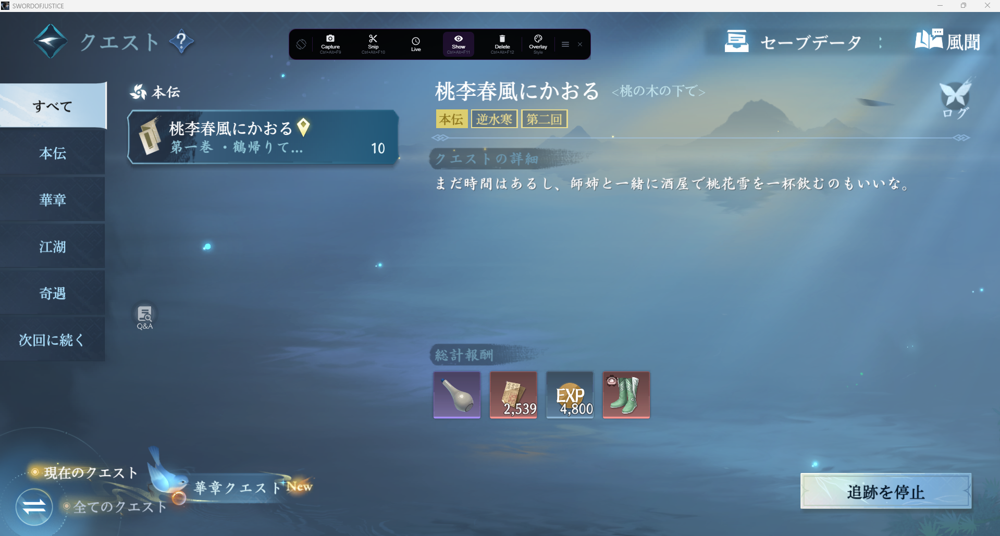
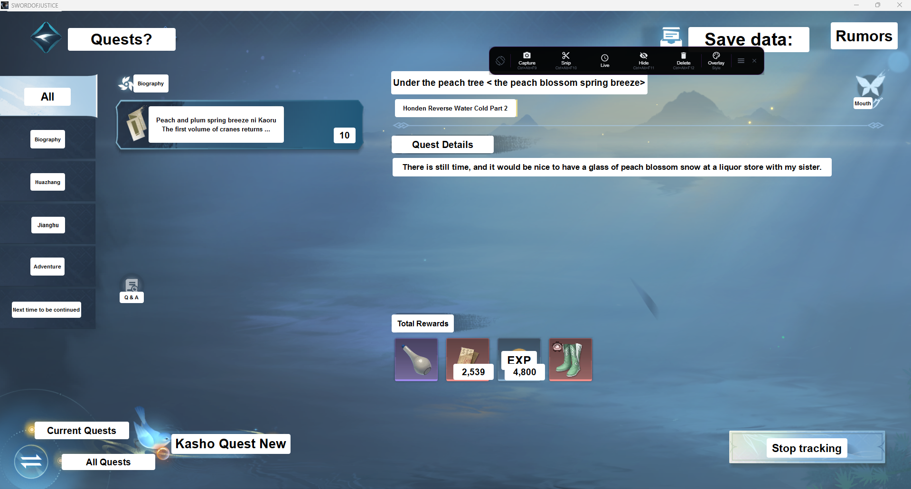
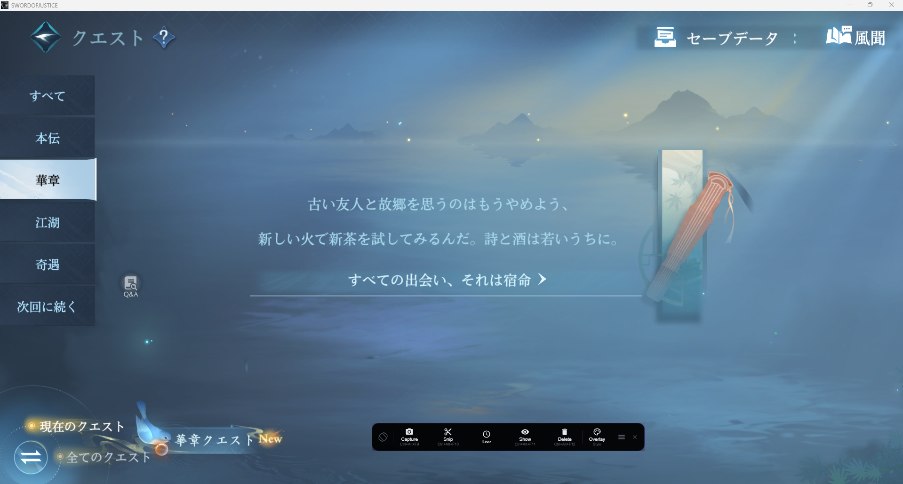
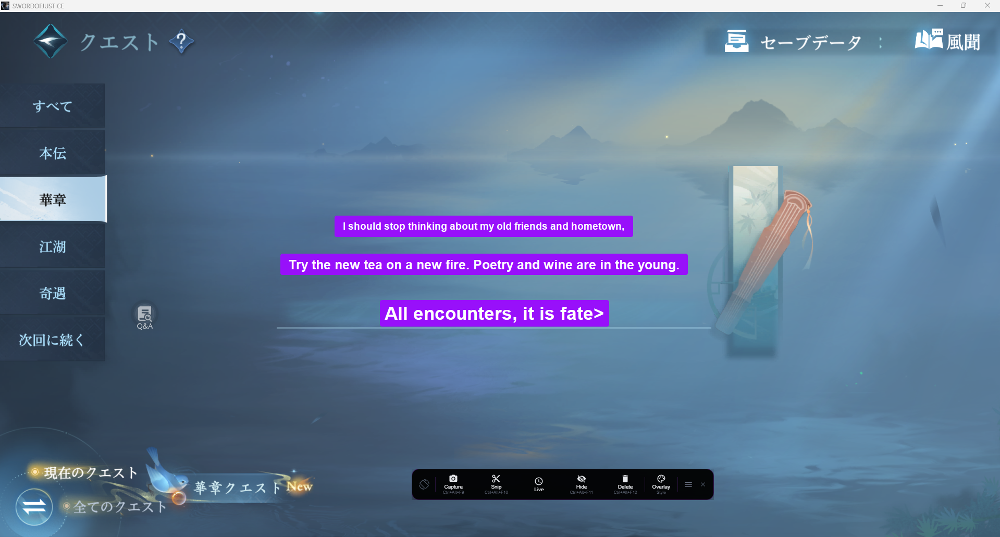
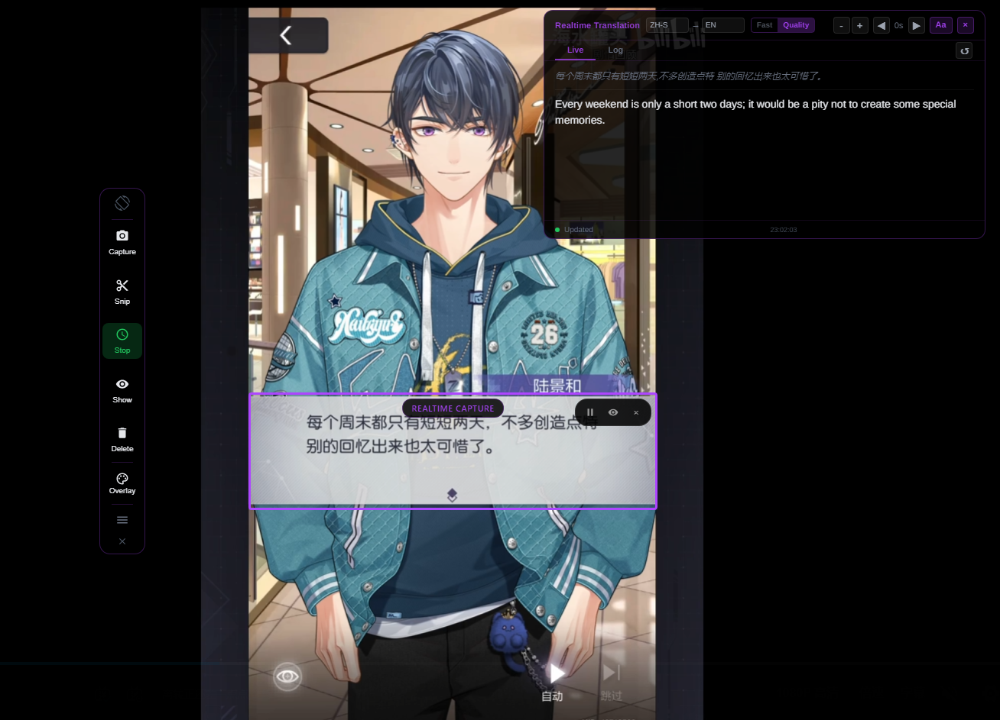
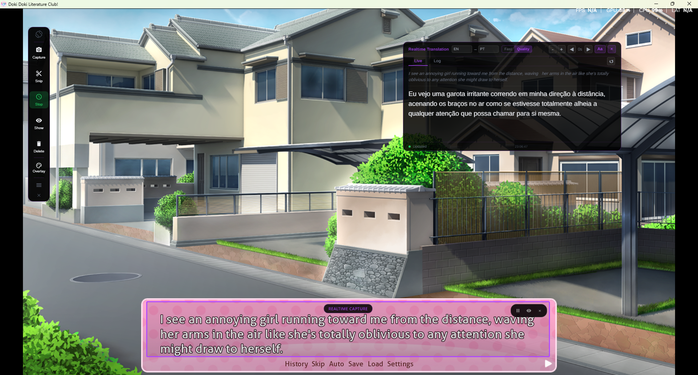
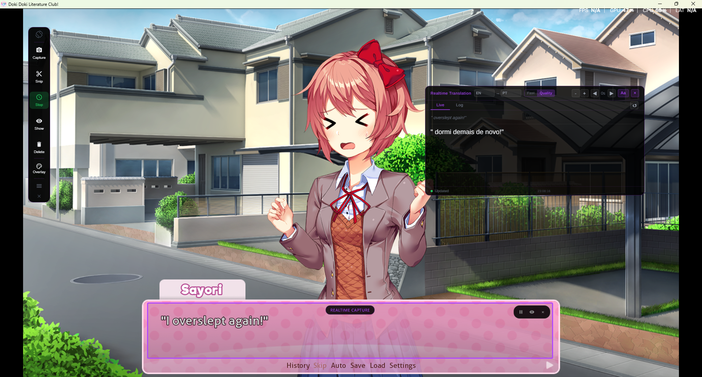
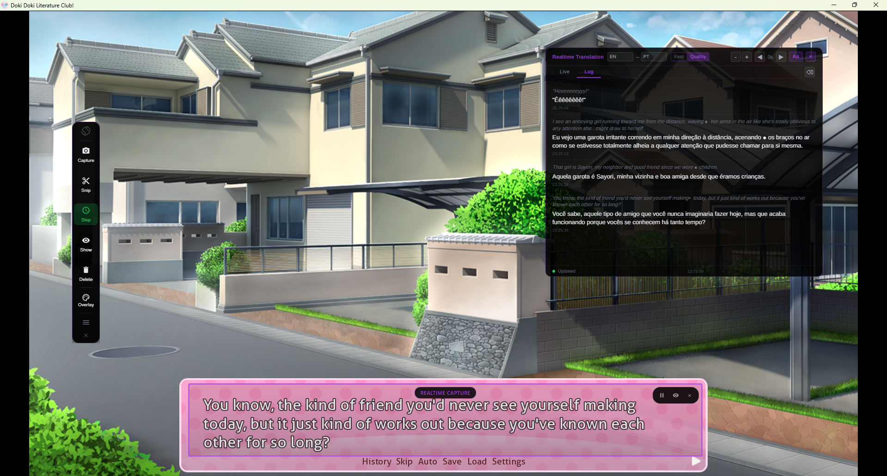

# 🌍 Lexa Translator

**Real-Time Screen Translation for Windows**  

Translate on-screen text instantly in games, videos, and applications.

---

## ⬇ Download

### 🏆 Microsoft Store (Recommended)

Install Lexa Translator with automatic updates and a secure, verified installation.

---

### 🛠 Manual Download (.exe)

Download the latest **Windows installer (.exe)** and install manually.

---

### 🌐 Official Website

[https://lexatranslator.com](https://lexatranslator.com)

Visit the official website to learn more, see updates, and access additional resources.

## 🚀 Overview

**Lexa Translator** is a powerful Windows desktop application that captures and translates text directly from your screen in real time.

Designed for gamers, visual novel readers, streamers, and productivity users, Lexa works seamlessly with **any on-screen application** without modifying the original program or game files.

It is fast, flexible, DPI-aware, and fully compatible with multi-monitor setups.

---

# ✨ Core Features

## 📸 Snapshot Mode

Capture the entire screen and translate everything at once.

- Full-screen screenshot capture  

- Automatic text detection  

- Translated text rendered as an overlay  

- Optional frame freeze for higher accuracy  

- Fully customizable overlay  

---

## ✂️ Snipping Mode

Select and translate a specific region of your screen.

- Custom area selection  

- Focused text detection  

- Clean overlay rendered only inside the selected area  

- Perfect for dialogue boxes and UI elements

---

## 🖱️ Cursor Mode

Translate text directly from the target window without breaking your workflow.

Works similarly to Snipping Mode, but operates directly inside the target window 

- Activated via hotkey for fast, uninterrupted usage  

- No overlay rendering, translation is displayed in a clean modal  

- Maintains focus on the original application  

Ideal for keeping immersion in games and continuous workflows  

Perfect for fast-paced gameplay, dialogue reading, and quick lookups  

---
## ⚡ Realtime Mode

Continuously capture and translate text inside a selected area.

- Resizable capture region  

- Dedicated translation window  

- Instant translation updates  

### 🟢 Live Tab

- Displays the most recent translated text  

- Adjustable delay for translation display  

- Option to clear current live text  

### 📜 Log Tab

- Full capture history  

- All entries automatically translated  

- Option to clear entire log history  

### ⚙️ Realtime Controls

- Increase or decrease translation text size  

- Show or hide original captured text  

- Move and resize translation window 

---

# 🎨 Overlay Customization (Snapshot \& Snipping)

Lexa provides advanced overlay controls:

- Change background color  

- Adjust text size  

- Modify overlay opacity  

This ensures maximum readability in any visual environment, dark scenes, bright UIs, or stylized games.

---

# ⚙️ System Configuration

- Change application interface language  

- Configure source (detection) language  

- Configure target translation language  

- Enable frame freeze for Snapshot/Snipping  

- DPI-aware scaling  

- Multi-monitor support  

---

# 🖥️ How It Works

1. User registers or logs in  

2. Selects the window to translate  

3. Opens the Lexa toolbar  

4. Chooses Snapshot, Snipping, or Realtime mode  

Lexa operates as a lightweight **Windows (.exe)** desktop application and runs independently of the target program.

---

# 🖼️ In-Game Preview

See Lexa Translator running inside real applications and games.

## 🎮 Snapshot Mode (In-Game)

Full-screen capture with translated overlay rendered directly over dialogue.

| Without Lexa | With Lexa Translator |
|---|---|
|  |  |

---

## ✂️ Snipping Mode (Dialogue Selection)

| Without Lexa | With Lexa Translator |
|---|---|
|  |  |

---

## 🖱️ Cursor Mode (In-Game)

| Cursor Mode — Example 1 | Cursor Mode — Example 2 |
|---|---|
|  |  |

---

## ⚡ Realtime Mode — Live Tab

Continuous translation while gameplay progresses.

---

## 📜 Realtime Mode — Log Tab

Full session history of captured and translated text.

---

# 💡 Use Cases

- Visual novels and story-driven games  

- Japanese, Chinese, and Korean games  

- Gameplay videos and recorded footage  

- Live stream translation assistance  

- Any video or application with on-screen text

---

# 🧩 Compatibility

- ✔ Windows Desktop (.exe)  

- ✔ Multi-screen setups  

- ✔ High DPI environments  

- ✔ Works with any on-screen application  

- ✔ No modification of original programs  

---

# 🎯 Mission

Lexa Translator transforms any window into a fully translatable experience.

> **Instantly. Seamlessly. Professionally.**
